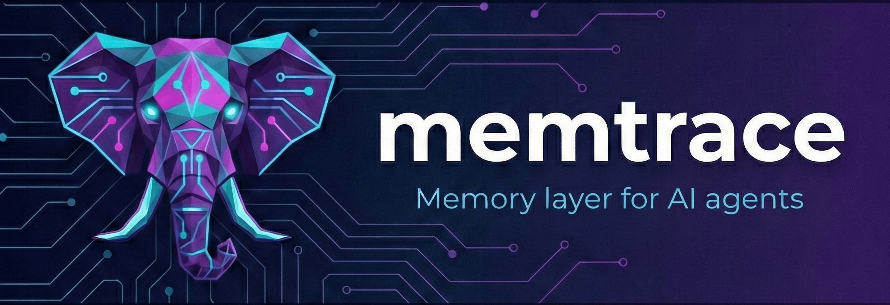

<p align="center">
  
</p>

# Memtrace

**LLM-agnostic memory layer for AI agents.** Works with ChatGPT, Claude, Gemini, DeepSeek, Llama — any LLM.

No embeddings. No vector DB. Just fast, structured, temporal memory that any LLM can consume as plain text context.

## Why Memtrace?

AI agents need memory to be useful. They need to remember what they did, what worked, what failed, and what decisions they made. Most memory solutions force you into vector databases and embeddings — adding latency, complexity, and cost.

Memtrace takes a different approach: **operational, temporal memory** built on a time-series database. Every action is temporal. Every query is time-windowed. The feedback loop — Memory, Decision, Action, Log, Repeat — works naturally with time-series data.

## Use Cases

### Autonomous Agents
An AI agent that runs for hours or days — browsing the web, writing code, managing infrastructure. It needs to remember what it already tried, what failed, and what decisions it made so it doesn't repeat mistakes or contradict itself.

**Example:** A coding agent that refactors a large codebase across multiple sessions, remembering which files it already changed, which tests broke, and what strategies worked.

### Customer Support
AI support agents handling conversations across channels. Each agent remembers the full customer history — previous tickets, resolutions, preferences — without re-reading everything from scratch. Multiple agents share context about the same customer in real time.

**Example:** A call center with 50 AI agents sharing a memory pool. When a customer calls back, any agent instantly knows what happened last time.

### Research & Analysis
AI agents that crawl, summarize, and analyze data over time. They need to track what they've already read, what patterns they've found, and what conclusions they've drawn — building knowledge incrementally instead of starting from zero.

**Example:** A market research agent that monitors competitor pricing daily, remembering trends and flagging anomalies against its own historical observations.

### DevOps & Monitoring
AI agents that watch infrastructure, respond to alerts, and take remediation actions. They need to remember what they already investigated, which runbooks they executed, and what the outcomes were — especially during incident response.

**Example:** An on-call agent that correlates a 3 AM alert with a similar incident it handled last Tuesday, remembers the fix that worked, and applies it automatically.

### Content & Social Media
AI agents that create, schedule, and manage content across platforms. They remember what topics performed well, what's already been posted, and what the audience engaged with — avoiding repetition and learning from results.

**Example:** A social media agent that posted about Go generics yesterday and decides to cover a different topic today based on engagement memory.

### Multi-Agent Collaboration
Teams of specialized agents working on the same goal — one researches, one writes, one reviews, one publishes. They share a memory space so each agent can see what the others have done and make decisions accordingly.

**Example:** A content pipeline where a research agent stores findings, a writing agent reads them to draft articles, and an editor agent reviews against the shared decision log.

### Sales & Outreach
AI agents that manage prospect pipelines, personalize outreach, and track interactions over time. They remember every touchpoint, what messaging resonated, and when to follow up.

**Example:** An SDR agent that remembers a prospect mentioned a conference last month, and uses that context to personalize the follow-up email.

### Data Processing Pipelines
Long-running ETL or data enrichment agents that process millions of records in batches. They need to track what's been processed, what failed, and where to resume — with deduplication built in.

**Example:** A data enrichment agent that processes 100K company records over 3 days, remembering which ones are done, which APIs timed out, and which need retry.

## Quick Start

### 1. Prerequisites

- Go 1.25+
- A running [Arc](https://github.com/Basekick-Labs/arc) instance

### 2. Install

```bash
git clone https://github.com/Basekick-Labs/memtrace.git
cd memtrace
make build
```

### 3. Configure

```bash
cp memtrace.toml memtrace.local.toml
# Edit memtrace.local.toml with your Arc URL
```

### 4. Run

```bash
./memtrace
```

On first run, Memtrace prints your admin API key. **Save it — it's shown only once.**

```
FIRST RUN: Save your admin API key (shown only once)
API Key: mtk_...
```

### 5. Use It

```bash
# Store a memory
curl -X POST http://localhost:9100/api/v1/memories \
  -H "x-api-key: mtk_..." \
  -H "Content-Type: application/json" \
  -d '{
    "agent_id": "my_agent",
    "content": "Crawled https://example.com — found 3 product pages",
    "memory_type": "episodic",
    "event_type": "page_crawled",
    "tags": ["crawling", "products"],
    "importance": 0.7
  }'

# Recall recent memories
curl "http://localhost:9100/api/v1/memories?agent_id=my_agent&since=2h" \
  -H "x-api-key: mtk_..."

# Get LLM-ready session context
curl -X POST http://localhost:9100/api/v1/sessions/sess_abc/context \
  -H "x-api-key: mtk_..." \
  -H "Content-Type: application/json" \
  -d '{"since": "4h", "include_types": ["episodic", "decision"]}'
```

## MCP Server (Claude Code, Cursor, etc.)

Memtrace ships an MCP server for integration with Claude Code, Claude Desktop, Cursor, Windsurf, Cline, Zed, and other MCP-compatible tools.

```bash
make build-mcp
```

Configure in Claude Code (`.mcp.json`):

```json
{
  "mcpServers": {
    "memtrace": {
      "command": "/path/to/memtrace-mcp",
      "env": {
        "MEMTRACE_URL": "http://localhost:9100",
        "MEMTRACE_API_KEY": "mtk_..."
      }
    }
  }
}
```

7 tools are available: `memtrace_remember`, `memtrace_recall`, `memtrace_search`, `memtrace_decide`, `memtrace_session_create`, `memtrace_session_context`, `memtrace_agent_register`. See the [MCP docs](./mcp.md) for full details.

## Go SDK

```go
import "github.com/Basekick-Labs/memtrace/pkg/sdk"

client := sdk.New("http://localhost:9100", "mtk_...")

// Quick add
client.Remember(ctx, "my_agent", "Posted tweet about Go generics")

// Recall recent
memories, _ := client.Recall(ctx, "my_agent", "48h")

// Log a decision
client.Decide(ctx, "my_agent", "post_to_twitter", "feed had interesting content")

// Full API
client.AddMemory(ctx, &sdk.AddMemoryRequest{...})
client.ListMemories(ctx, &sdk.ListOptions{...})
client.SearchMemories(ctx, &sdk.SearchQuery{...})
client.CreateSession(ctx, &sdk.CreateSessionRequest{...})
client.GetSessionContext(ctx, sessionID, &sdk.ContextOptions{...})
```

## Documentation

- [Architecture](./architecture.md) — How Memtrace works under the hood
- [API Reference](./api.md) — Complete REST API documentation
- [Configuration](./configuration.md) — All config options, environment variables, and deployment
- [MCP Server](./mcp.md) — Model Context Protocol server for Claude Code, Cursor, and more

## How It Works

Memtrace stores memories as time-series events in [Arc](https://github.com/Basekick-Labs/arc), a high-performance time-series database. Each memory has a type (`episodic`, `decision`, `entity`, `session`), tags, importance score, and metadata. Queries are time-windowed by default — "what happened in the last 2 hours?" is a first-class operation.

The **session context** endpoint is the killer feature: it queries memories for a session, groups them by type, and returns LLM-ready markdown that you inject directly into any prompt. No parsing, no transformation — just paste it into your system prompt.

Read the full [Architecture](./architecture.md) doc for details on the data model, deduplication, write batching, and shared memory.

## License

Open source. See [LICENSE](../LICENSE) for details.
